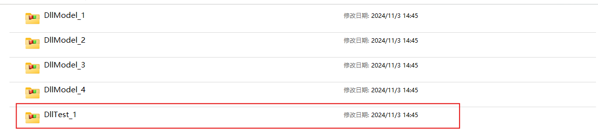
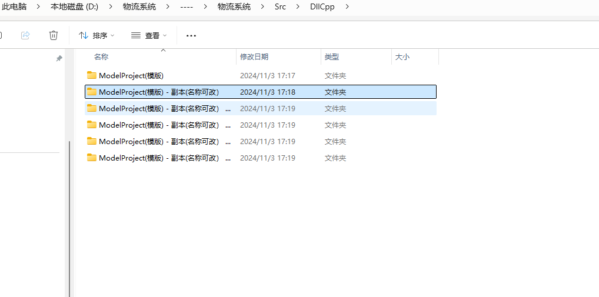

# 物流系统
 物流系统
# 项目入口

**后端开发项目文件**
- 物流系统\Src\CppDll\CppDll.sln
**前端开发项目文件**
- 物流系统\Src\PyScript\PyScript.sln
# 推荐开发插件 Fitten Code

# 创建新项目
- **快捷方式进入的是这个项目**

- **其他几个都是我提前配置好的，直接点击里面的sin就可以使用**
- ***如果还不够用，可以复制DllTest_1文件夹到当前目录进行开发***
# 创建项目启动的快捷方式

- **创建的快捷方式统一放置到“后端开发入口”**

- **点击就可快速进入项目**
- 
  
# DLL调试与生成
- 使用main调用dll的函数，可以进行调试
- 项目默认生成的exe,如果要生成dll要修改以下
  
   - 右键项目->属性->配置->常规->配置类型->动态链接库(.dll)
   - 调用生成的dll，需要将配置改回exe
 - 调用调试
   - 需要一个头文件
   - 
   - 一个cpp
   - 
   - 一个main.cpp
   - 
   - 然后记得改回生成exe的配置,编译运行后就可以运行
