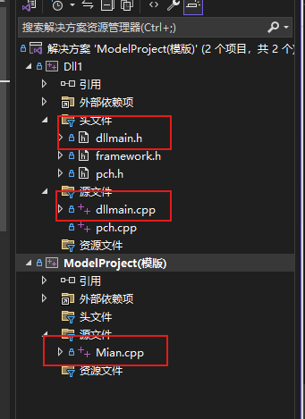
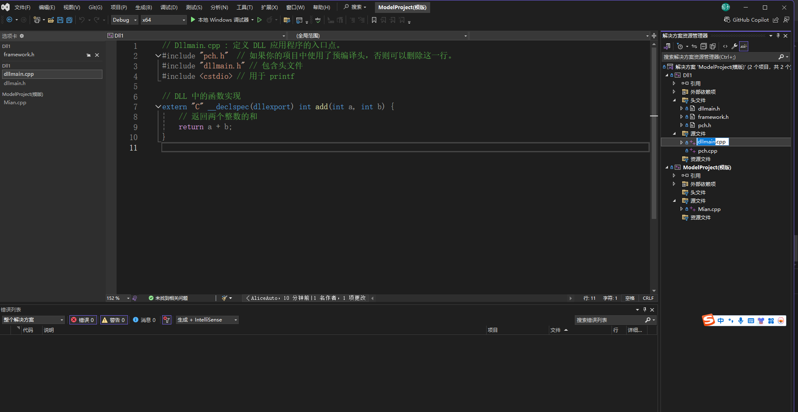

# 物流系统
 物流系统
# 项目入口

**后端开发项目文件**
- 物流系统\Src\CppDll\CppDll.sln
**前端开发项目文件**
- 物流系统\Src\PyScript\PyScript.sln
# 推荐开发插件 Fitten Code

# 创建新项目
- ！！！**创建新项目只能复制模版进行开发，不能直接创建，避免重新配置**
- **快捷方式进入的是这个项目**

- **其他几个都是我提前配置好的，直接点击里面的sin就可以使用**
- ***如果还不够用，可以复制模版文件夹到当前目录进行开发***!
# 创建项目启动的快捷方式

- **创建的快捷方式统一放置到“后端开发入口”**

- **点击就可快速进入项目**
- 
  
# DLL调试与生成

***通过复制模版项目文件夹创建的项目会默认带有一个main调用文件以及`dll源文件、头文件`***
其中还有一些文件无关紧要可删去
- 编写dll代码不同的是需要同时有.h文件与cpp文件，需要将声明(外部接口)与实现分开，以便于调用。
- 头文件
  
- dll源文件
  
- main调用文件
 
**项目执行**
